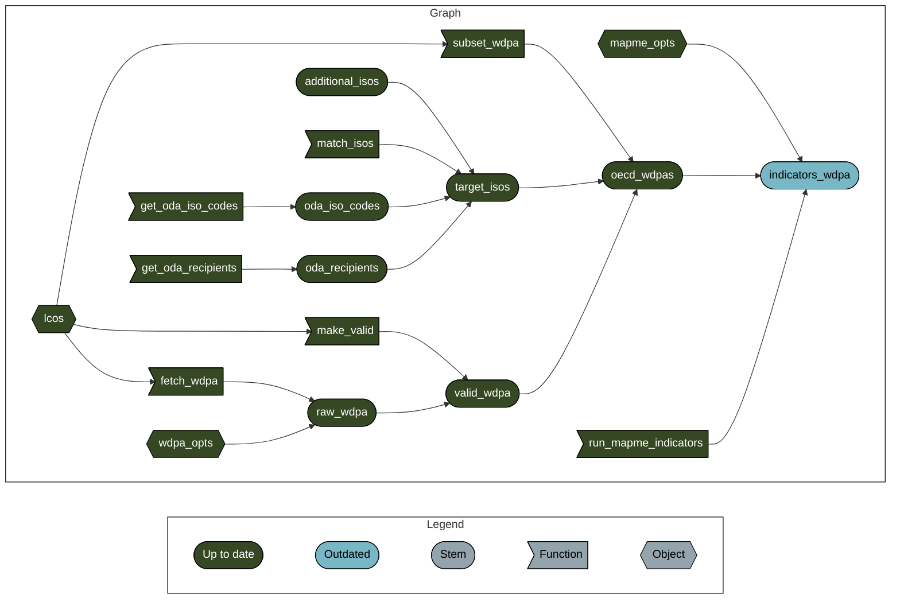

<!-- README.md is generated from README.Rmd. Please edit that file -->

# oda-portfolio

<!-- badges: start -->

[](https://www.tidyverse.org/lifecycle/#experimental)
<!-- badges: end -->

The goal of oda-portfolio is to establish a pipeline with the
`{targets}` package to calculated indicators for all protected areas
within countries that received official development aid by OECD member
countries.



To run the pipeline adjust `_targets.R` and `config-oecd-countries.yaml`
to your local settings and then run the following from a shell:

``` shell
$ Rscript -e 'targets::tar_make()'
```
