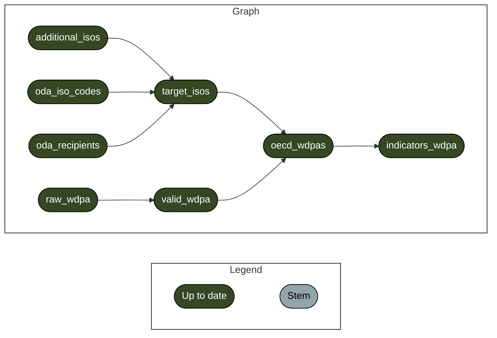

<!-- README.md is generated from README.Rmd. Please edit that file -->

<!-- badges: start -->

[](https://www.tidyverse.org/lifecycle/#experimental)
<!-- badges: end -->

# oda-portfolio

The codes in this repository establish a pipeline with the
[`{targets}`](https://books.ropensci.org/targets/) package to calculated
a number of biodiversity related indicators for all protected areas
within countries that received official development aid by OECD member
countries.

For this, the World Database on Protected Areas (WDPA) is downloaded and
pre-processed to correct invalid geometries. From the OECD data sharing
platform, information about which countries received ODA is fetched.
Additional countries to be included in the analysis can be added by
manually listing ISO3 codes in a new line in the file called
[`additional_isos`](additional_isos).

Indicators are calculated using
[`mapme.pipelines`](https://github.com/mapme-initiative/mapme.pipelines).
The indicator configuration can be changed by adapting
[`config.yaml`](config.yaml).

High-level configuration, such as WDPA version, data directories and
outputs can be configured by adapting [`_targets.R`](_targets.R).

The pipeline currently consists of the following functionality:

- [`wdpa.R`](R/wdpa.R): fetching and pre-processing WDPA data
- [`oecd.R`](R/oecd.R): fetching OECD information and subsetting WDPA to
  respective ISO3 codes
- [`mapme.R`](R/mapme.R): indicator calculation with
  [`mapme.pipelines`](https://github.com/mapme-initiative/mapme.pipelines)

To run the pipeline, issue the following command in a shell:

``` shell
$ Rscript -e 'targets::tar_make()'
```

Together these routines establish the following pipeline:


